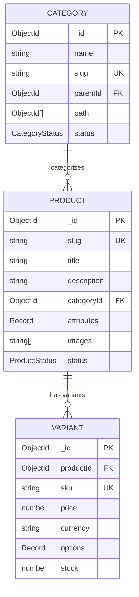

# Documentación de Modelos del Catálogo

Esta documentación describe los modelos de datos utilizados en el sistema de catálogo de productos.

## Tabla de Contenidos

- [Product (Producto)](#product-producto)
- [Variant (Variante)](#variant-variante)
- [Category (Categoría)](#category-categoría)
- [Relaciones entre Modelos](#relaciones-entre-modelos)
- [Convenciones y Reglas](#convenciones-y-reglas)

---

## Product (Producto)

**Ubicación**: `api/src/products/schemas/product.schema.ts`

Representa un producto en el catálogo. Un producto puede tener múltiples variantes (ej: diferentes tallas, colores).

### Campos

| Campo | Tipo | Obligatorio | Validaciones | Descripción |
|-------|------|-------------|--------------|-------------|
| `_id` | `ObjectId` | Sí (auto) | - | Identificador único del producto |
| `slug` | `string` | **Sí** | trim, lowercase, unique | URL amigable del producto |
| `title` | `string` | **Sí** | trim | Nombre del producto |
| `description` | `string` | No | trim | Descripción detallada del producto |
| `categoryId` | `ObjectId` | **Sí** | ref: Category | Referencia a la categoría |
| `attributes` | `Record<string, string\|number>` | No | - | Atributos personalizados (marca, modelo, etc.) |
| `images` | `string[]` | No | default: [] | URLs de imágenes del producto |
| `status` | `ProductStatus` | **Sí** | enum | Estado del producto (ver tipos) |
| `createdAt` | `Date` | Sí (auto) | - | Fecha de creación |
| `updatedAt` | `Date` | Sí (auto) | - | Fecha de última actualización |

### Tipos

```typescript
export type ProductStatus = 'draft' | 'active' | 'archived';
```

- **`draft`**: Borrador, no visible en tienda
- **`active`**: Activo, visible en tienda
- **`archived`**: Archivado, no visible (soft-delete)

### Índices

- `slug`: Único
- `categoryId`: Para consultas por categoría
- `status`: Para filtrado por estado
- `title`, `description`: Búsqueda de texto completo

### Ejemplo

```json
{
  "_id": "507f1f77bcf86cd799439011",
  "slug": "poco-x7-pro",
  "title": "POCO X7 Pro",
  "description": "Smartphone con cámara de 50MP",
  "categoryId": "507f1f77bcf86cd799439022",
  "attributes": {
    "marca": "POCO",
    "modelo": "X7 Pro"
  },
  "images": ["https://ejemplo.com/imagen1.jpg"],
  "status": "active",
  "createdAt": "2024-01-15T10:00:00Z",
  "updatedAt": "2024-01-15T10:00:00Z"
}
```

---

## Variant (Variante)

**Ubicación**: `api/src/variants/schemas/variant.schema.ts`

Representa una variante específica de un producto (ej: POCO X7 Pro - Negro - 256GB).

### Campos

| Campo | Tipo | Obligatorio | Validaciones | Descripción |
|-------|------|-------------|--------------|-------------|
| `_id` | `ObjectId` | Sí (auto) | - | Identificador único de la variante |
| `productId` | `ObjectId` | **Sí** | ref: Product, index | Referencia al producto padre |
| `sku` | `string` | **Sí** | trim, uppercase, unique | Código único de producto (Stock Keeping Unit) |
| `price` | `number` | **Sí** | min: 0 | Precio de venta |
| `currency` | `string` | **Sí** | trim, uppercase, maxLength: 10 | Código de moneda (USD, MXN, etc.) |
| `options` | `Record<string, string>` | No | default: {} | Opciones de la variante (color, talla, etc.) |
| `stock` | `number` | No | min: 0 | Cantidad disponible en inventario |
| `createdAt` | `Date` | Sí (auto) | - | Fecha de creación |
| `updatedAt` | `Date` | Sí (auto) | - | Fecha de última actualización |

### Índices

- `productId`: Para consultas por producto
- `sku`: Único

### Ejemplo

```json
{
  "_id": "507f1f77bcf86cd799439033",
  "productId": "507f1f77bcf86cd799439011",
  "sku": "POCO-X7-BLK-256",
  "price": 299.99,
  "currency": "USD",
  "options": {
    "color": "Negro",
    "storage": "256GB"
  },
  "stock": 50,
  "createdAt": "2024-01-15T10:30:00Z",
  "updatedAt": "2024-01-15T10:30:00Z"
}
```

---

## Category (Categoría)

**Ubicación**: `api/src/categories/schemas/category.schema.ts`

Representa una categoría de productos. Soporta jerarquías (categorías padre/hijo).

### Campos

| Campo | Tipo | Obligatorio | Validaciones | Descripción |
|-------|------|-------------|--------------|-------------|
| `_id` | `ObjectId` | Sí (auto) | - | Identificador único de la categoría |
| `name` | `string` | **Sí** | trim | Nombre de la categoría |
| `slug` | `string` | **Sí** | trim, lowercase, unique | URL amigable de la categoría |
| `parentId` | `ObjectId` | No | ref: Category | Categoría padre (null si es raíz) |
| `path` | `ObjectId[]` | No | default: [] | Ruta completa de categorías desde raíz |
| `status` | `CategoryStatus` | **Sí** | enum | Estado de la categoría (ver tipos) |
| `createdAt` | `Date` | Sí (auto) | - | Fecha de creación |
| `updatedAt` | `Date` | Sí (auto) | - | Fecha de última actualización |

### Tipos

```typescript
export type CategoryStatus = 'active' | 'hidden' | 'archived';
```

- **`active`**: Activa, visible en tienda
- **`hidden`**: Oculta, no visible pero funcional
- **`archived`**: Archivada, no visible (soft-delete)

### Índices

- `slug`: Único
- `path`: Para consultas jerárquicas

### Ejemplo

```json
{
  "_id": "507f1f77bcf86cd799439022",
  "name": "Smartphones",
  "slug": "smartphones",
  "parentId": "507f1f77bcf86cd799439020",
  "path": ["507f1f77bcf86cd799439020"],
  "status": "active",
  "createdAt": "2024-01-10T08:00:00Z",
  "updatedAt": "2024-01-10T08:00:00Z"
}
```

---

## Relaciones entre Modelos



### Descripción de Relaciones

1. **Category → Product** (1:N)
   - Una categoría puede tener muchos productos
   - Un producto pertenece a una sola categoría
   - Campo: `Product.categoryId` → `Category._id`

2. **Product → Variant** (1:N)
   - Un producto puede tener muchas variantes
   - Una variante pertenece a un solo producto
   - Campo: `Variant.productId` → `Product._id`

3. **Category → Category** (1:N - Auto-referencia)
   - Una categoría puede tener una categoría padre
   - Una categoría puede tener muchas categorías hijas
   - Campo: `Category.parentId` → `Category._id`

---

## Convenciones y Reglas

### Soft Delete

**Implementación Actual**: Soft-delete conceptual usando campo `status`

- **Productos**: `status: 'archived'` en lugar de borrado físico
- **Categorías**: `status: 'archived'` en lugar de borrado físico
- **Variantes**: Borrado físico permitido (vinculadas a producto)

**Razón**: Permite recuperación de datos y mantiene historial de pedidos.

**Futuro (Opcional)**: Agregar campo `deletedAt: Date` si se necesita rastrear fecha exacta de archivado.

### Unicidad

- **Product.slug**: Debe ser único globalmente
- **Variant.sku**: Debe ser único globalmente
- **Category.slug**: Debe ser único globalmente

### Mayúsculas/Minúsculas

- **lowercase**: `Product.slug`, `Category.slug`
- **UPPERCASE**: `Variant.sku`, `Variant.currency`
- **trim**: Todos los strings para consistencia

### Validaciones de Negocio

1. **Precio**: Siempre `>= 0`
2. **Stock**: Opcional, pero si existe debe ser `>= 0`
3. **SKU**: Recomendado formato: `MARCA-MODELO-VARIANTE-ATRIBUTOS`
   - Ejemplo: `POCO-X7-BLK-256`
4. **Currency**: Código ISO 4217 de 3 letras (USD, EUR, MXN)

### Estados por Defecto

- **Product**: `draft` (requiere activación manual)
- **Category**: `active` (visible inmediatamente)
- **Variant**: No tiene estado propio, hereda del producto padre

### Campos Futuros (Fases 2-6)

Los siguientes campos se agregarán en fases futuras:

#### Fase 2 - Media y SEO
- `Product.seoTitle: string?`
- `Product.seoDescription: string?`
- Entidad `ProductImage` con `position`, `altText`

#### Fase 3 - Variantes Enriquecidas
- `Variant.compareAtPrice: number?` (precio de comparación/tachadazo)
- `Variant.cost: number?` (costo de adquisición - **requiere permisos**)
- `Variant.barcode: string?` (UPC/EAN/ISBN)
- `Variant.weight: number?` (peso en gramos)
- `Variant.imageId: ObjectId?` (referencia a ProductImage)

#### Fase 5 - Opciones Dinámicas
- `Product.option1Name: string?` (ej: "Color")
- `Product.option2Name: string?` (ej: "Talla")
- `Product.option3Name: string?` (ej: "Material")
- `Variant.option1Value: string?`
- `Variant.option2Value: string?`
- `Variant.option3Value: string?`

---

## Consultas Comunes

### Obtener productos de una categoría

```typescript
const products = await Product.find({ 
  categoryId: categoryId,
  status: 'active' 
});
```

### Obtener variantes de un producto

```typescript
const variants = await Variant.find({ 
  productId: productId 
});
```

### Buscar productos por texto

```typescript
const products = await Product.find({
  $text: { $search: 'smartphone' },
  status: 'active'
});
```

### Árbol de categorías

```typescript
// Categorías raíz
const rootCategories = await Category.find({ 
  parentId: null,
  status: 'active'
});

// Hijas de una categoría
const children = await Category.find({ 
  parentId: categoryId,
  status: 'active'
});
```

---

## Migraciones

**Versión actual**: 1.0 (Base inicial)

**Futuras migraciones** (según fases):
- `V1_1__add_product_seo_fields` (Fase 2)
- `V1_2__add_variant_enriched_fields` (Fase 3)
- `V1_3__add_dynamic_options` (Fase 5)

---

## Notas de Seguridad

> [!CAUTION]
> **Campo sensible futuro**: `Variant.cost`
> 
> Cuando se implemente en Fase 3, este campo debe tener restricciones de acceso:
> - Solo roles: `admin`, `finance`, `manager`
> - Nunca exponer en APIs públicas
> - Usar DTOs separados para ocultar en respuestas

---

## Changelog

### Versión 1.0 - Estado Actual (2024-01-15)

- ✅ Modelo Product con status, images, attributes
- ✅ Modelo Variant con price, currency, options, stock
- ✅ Modelo Category con jerarquías (parentId, path)
- ✅ Soft-delete conceptual con status
- ✅ Índices para optimización de consultas
- ✅ Timestamps automáticos

### Versión 1.1 - Planeado (Fase 2)

- [ ] Entidad ProductImage
- [ ] Campos SEO en Product

### Versión 1.2 - Planeado (Fase 3)

- [ ] Campos enriquecidos en Variant
- [ ] Sistema de permisos para campo cost

---

**Última actualización**: 2024-11-27  
**Mantenido por**: Equipo de Desarrollo
